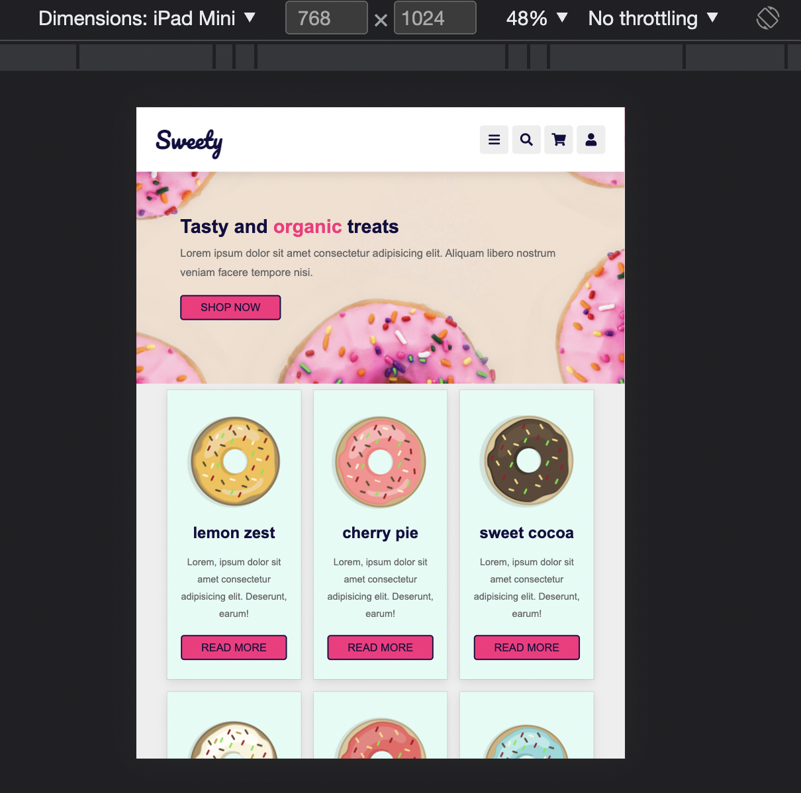
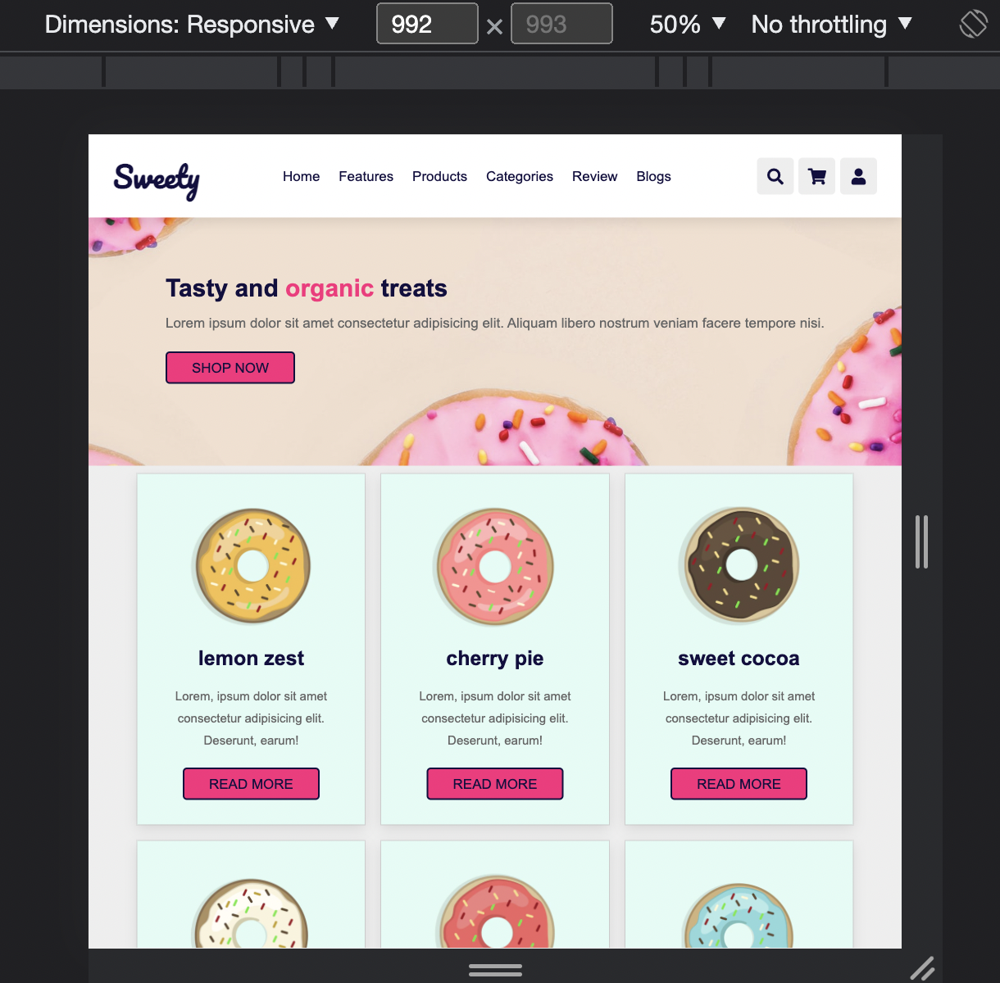

# UIB-sweety-layout

- Take a look at the screenshots in the design folder
- Create a responsive page based on the screenshots using flex and media queries

## Instructions

- Use CSS custom properties
- Use semantic tags (`header`, `main`, `nav`, `footer` etc.)
- Navigation should stay put while scrolling.
- Navigation links should be hidden on mobile.
- Make sure you show the burger icon on mobile ( no functionality ).
- Menu links should have a deep pink underline on hover
- Icons should have a deep pink background on hover

## Note:

- The text 'Sweety' is font 'Pacifico' from Google Fonts
- Other texts are 'Arial'

## Demo

https://user-images.githubusercontent.com/82094277/199498935-489679f7-409b-4380-9a46-14942342b30d.mov

## Tablet

## Desktop

## Extra

[//]: # (autograding info start)
#  Results
> ⌛ Give it a minute. As long as you see the orange dot  on top, CodeBuddy is still processing. Refresh this page to see it's current status.
>
> This is what CodeBuddy found when running your code. It is to show you what you have achieved and to give you hints on how to complete the exercise.

### Markup

|                 Status                  | Check                                                                                    |
| :-------------------------------------: | :--------------------------------------------------------------------------------------- |
|  | Page should have a title |
|  | Page header is defined as `header` element |
|  | The header should be fixed at the top of the page |
|  | Page should have a `nav` for navigation |
|  | Navigation should contain links |
|  | Navigation items should have hover effect |

### Layout and Responsiveness

|                 Status                  | Check                                                                                    |
| :-------------------------------------: | :--------------------------------------------------------------------------------------- |
|  | On desktop screen, the first products should be aranged in three columns |
|  | On mobile screen, the products should be arranged in a single column |
|  | Page should not have horizontal overflow on mobile devices |

[🔬 Results Details](../../actions)
[🐞 Tips on Debugging](https://github.com/DCI-EdTech/autograding-setup/wiki/How-to-work-with-CodeBuddy)
[📢 Report Problem](https://docs.google.com/forms/d/e/1FAIpQLSfS8wPh6bCMTLF2wmjiE5_UhPiOEnubEwwPLN_M8zTCjx5qbg/viewform?usp=pp_url&entry.652569746=UIB-sweety-layout)

[//]: # (autograding info end)